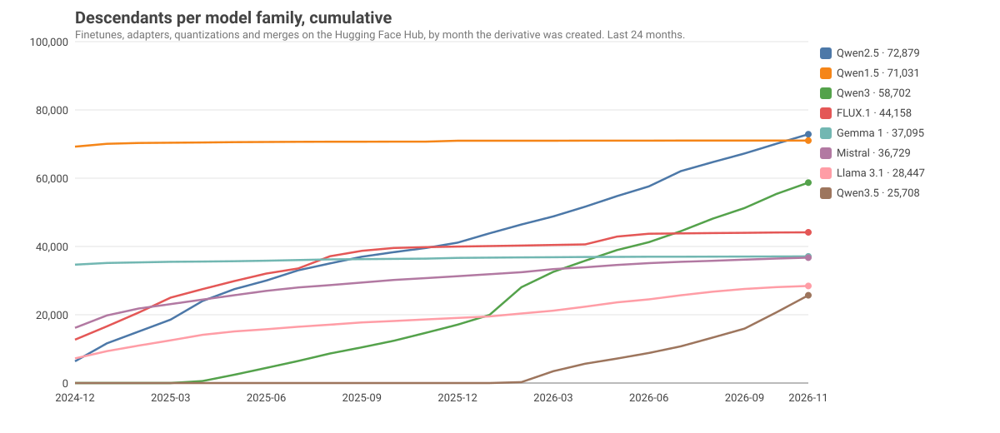

<div align="center">

<a href="https://h9-tec.github.io/model-family-tree/galaxy.html"></a>

**[Fly through the Model Galaxy →](https://h9-tec.github.io/model-family-tree/galaxy.html)** · 989,810 models in one zoomable WebGL map · **[Explorer →](https://h9-tec.github.io/model-family-tree/)** · search any model, walk its pedigree, share a link.

# Open Model Family Tree

**Every model on the Hugging Face Hub, its ancestry, and a leaderboard of the base models the ecosystem actually builds on. Rebuilt nightly.**


[](https://github.com/h9-tec/model-family-tree/stargazers)
[](LICENSE)

</div>

**3,258,941** models · **942,840** declare a base model (29%) · **976,261** parent links · **93,807** models have descendants · **46,932** roots in **25,176** families

The most built-on model on the Hub is **[black-forest-labs/FLUX.1-dev](https://huggingface.co/black-forest-labs/FLUX.1-dev)** with **43,719** descendants. In the last 90 days it is **[Qwen/Qwen3.8-27B](https://huggingface.co/Qwen/Qwen3.8-27B)** with **5,131** new ones. The biggest family is **Qwen2.5** (72,585).

## Install into your agent

```bash
claude plugin marketplace add h9-tec/model-family-tree
claude plugin install model-family-tree@model-family-tree
```

Requires [uv](https://docs.astral.sh/uv/) on PATH. Then ask Claude: *what is unsloth/Qwen2.5-7B-Instruct based on, and which Qwen base has the most finetunes?* It answers from the `lineage` and `leaderboard` MCP tools.

<details>
<summary>Any MCP client</summary>

```json
{"mcpServers": {"model-family-tree": {"command": "uv", "args": ["run", "--frozen", "--no-dev", "--directory", "/path/to/model-family-tree", "python", "mcp/server.py"]}}}
```

Tools: `lineage(id)`, `children(id)`, `leaderboard(kind)`, `family(name)`, `search(query)`.

</details>

## See it

| | |
|---|---|
| **[Galaxy](https://h9-tec.github.io/model-family-tree/galaxy.html)** | Every model that has an ancestor or a descendant (989,810 points) in one WebGL map. Families are circle-packed clusters, base models are stars, each derivative is a dot colored by relation and sized by downloads. Scroll to zoom from the whole Hub down to one model, click any dot. |
| **[Explorer](https://h9-tec.github.io/model-family-tree/)** | Type any model id. Its pedigree is drawn as a radial tree: every ancestor path fans out to the left (merges show all parents), the most downloaded descendants to the right, unfoldable level by level, live from the Hub. |
| **[Leaderboard](https://h9-tec.github.io/model-family-tree/#board:all)** | All 93,807 models with descendants, sortable and filterable, plus the curated views below. |

<a href="assets/families.svg"></a>

## Most-descended base models

Unique descendants of every kind: finetunes, adapters (LoRA), quantizations and merges, each counted once however many paths reach it. † marks a base that was deleted or made private but is still referenced. [Full top 500 →](docs/tables/models_all_time.md)

| # | Model | Descendants | Direct | Last 90d | Finetune / adapter / quantized / merge | Family |
|---:|---|---:|---:|---:|---|---|
| 1 | [black-forest-labs/FLUX.1-dev](https://huggingface.co/black-forest-labs/FLUX.1-dev) | 43,719 | 43,442 | 219 | 696 / 42,870 / 137 / 16 | FLUX.1 |
| 2 | [Qwen/Qwen1.5-0.5B](https://huggingface.co/Qwen/Qwen1.5-0.5B) | 32,562 | 32,534 | 0 | 40 / 32,475 / 45 / 2 | Qwen1.5 |
| 3 | [Qwen/Qwen1.5-1.8B](https://huggingface.co/Qwen/Qwen1.5-1.8B) | 30,658 | 30,628 | 2 | 36 / 30,591 / 29 / 2 | Qwen1.5 |
| 4 | [google/gemma-2b](https://huggingface.co/google/gemma-2b) | 24,118 | 24,038 | 8 | 312 / 23,706 / 89 / 11 | Gemma 1 |
| 5 | [Qwen/Qwen2.5-7B](https://huggingface.co/Qwen/Qwen2.5-7B) | 23,383 | 2,008 | 2,612 | 12,254 / 6,926 / 3,610 / 593 | Qwen2.5 |
| 6 | [meta-llama/Llama-3.1-8B](https://huggingface.co/meta-llama/Llama-3.1-8B) | 21,853 | 3,230 | 1,697 | 9,595 / 6,222 / 5,186 / 850 | Llama 3.1 |
| 7 | [meta-llama/Llama-3.1-8B-Instruct](https://huggingface.co/meta-llama/Llama-3.1-8B-Instruct) | 15,435 | 7,486 | 1,322 | 6,934 / 4,144 / 3,639 / 718 | Llama 3.1 |
| 8 | [Qwen/Qwen2.5-7B-Instruct](https://huggingface.co/Qwen/Qwen2.5-7B-Instruct) | 15,140 | 6,891 | 2,018 | 8,832 / 4,053 / 1,844 / 411 | Qwen2.5 |
| 9 | [distilbert/distilbert-base-uncased](https://huggingface.co/distilbert/distilbert-base-uncased) | 13,811 | 13,429 | 724 | 13,247 / 404 / 159 / 1 | DistilBERT |
| 10 | [mistralai/Mistral-7B-v0.1](https://huggingface.co/mistralai/Mistral-7B-v0.1) | 11,643 | 4,016 | 86 | 3,006 / 5,186 / 2,071 / 1,365 | Mistral |
| 11 | [Qwen/Qwen2.5-1.5B](https://huggingface.co/Qwen/Qwen2.5-1.5B) | 11,616 | 1,095 | 1,941 | 5,279 / 4,340 / 1,832 / 165 | Qwen2.5 |
| 12 | [stabilityai/stable-diffusion-xl-base-1.0](https://huggingface.co/stabilityai/stable-diffusion-xl-base-1.0) | 11,607 | 11,122 | 253 | 1,426 / 10,071 / 56 / 54 | Stable Diffusion |
| 13 | [Qwen/Qwen3-4B-Instruct-2507](https://huggingface.co/Qwen/Qwen3-4B-Instruct-2507) | 11,453 | 9,071 | 1,613 | 3,642 / 6,563 / 1,155 / 93 | Qwen3 |
| 14 | [meta-llama/Meta-Llama-3-8B](https://huggingface.co/meta-llama/Meta-Llama-3-8B) | 10,327 | 1,727 | 102 | 4,250 / 2,073 / 3,015 / 989 | Llama 3 |
| 15 | [Qwen/Qwen3-8B-Base](https://huggingface.co/Qwen/Qwen3-8B-Base) | 10,213 | 932 | 2,035 | 5,087 / 3,145 / 1,907 / 73 | Qwen3 |
| 16 | [HuggingFaceTB/SmolLM2-360M](https://huggingface.co/HuggingFaceTB/SmolLM2-360M) | 10,193 | 206 | 1,604 | 9,157 / 663 / 368 / 5 | SmolLM2 |
| 17 | [Qwen/Qwen2.5-0.5B](https://huggingface.co/Qwen/Qwen2.5-0.5B) | 10,150 | 1,493 | 1,293 | 6,222 / 2,464 / 1,404 / 60 | Qwen2.5 |
| 18 | [google/gemma-7b](https://huggingface.co/google/gemma-7b) | 9,862 | 9,589 | 9 | 460 / 9,296 / 98 / 8 | Gemma 1 |
| 19 | [HuggingFaceTB/SmolLM2-360M-Instruct](https://huggingface.co/HuggingFaceTB/SmolLM2-360M-Instruct) | 9,719 | 434 | 1,560 | 8,991 / 430 / 293 / 5 | SmolLM2 |
| 20 | [HuggingFaceTB/SmolVLM-500M-Instruct](https://huggingface.co/HuggingFaceTB/SmolVLM-500M-Instruct) | 8,939 | 93 | 1,382 | 8,706 / 165 / 68 / 0 | SmolLM2 |
| 21 | [Qwen/Qwen2.5-3B](https://huggingface.co/Qwen/Qwen2.5-3B) | 8,892 | 1,148 | 1,177 | 3,967 / 3,241 / 1,599 / 85 | Qwen2.5 |
| 22 | [HuggingFaceTB/SmolVLM2-500M-Video-Instruct](https://huggingface.co/HuggingFaceTB/SmolVLM2-500M-Video-Instruct) | 8,837 | 141 | 1,366 | 8,672 / 134 / 31 / 0 | SmolLM2 |
| 23 | [lerobot/smolvla_base](https://huggingface.co/lerobot/smolvla_base) | 8,692 | 8,626 | 1,345 | 8,569 / 116 / 7 / 0 | SmolLM2 |
| 24 | [Qwen/Qwen3-8B](https://huggingface.co/Qwen/Qwen3-8B) | 8,423 | 5,460 | 1,547 | 3,870 / 2,906 / 1,577 / 69 | Qwen3 |
| 25 | [google-bert/bert-base-uncased](https://huggingface.co/google-bert/bert-base-uncased) | 7,707 | 7,462 | 464 | 7,468 / 148 / 84 / 7 | BERT |

## Hot right now: new descendants in the last 90 days

[Full top 500 →](docs/tables/models_90d.md)

| # | Model | Descendants | Direct | Last 90d | Finetune / adapter / quantized / merge | Family |
|---:|---|---:|---:|---:|---|---|
| 1 | [Qwen/Qwen3.8-27B](https://huggingface.co/Qwen/Qwen3.8-27B) | 6,716 | 3,307 | 5,131 | 1,542 / 583 / 4,518 / 73 | Qwen3.8 |
| 2 | [Qwen/Qwen3.5-4B-Base](https://huggingface.co/Qwen/Qwen3.5-4B-Base) | 6,628 | 571 | 3,898 | 2,686 / 1,835 / 2,046 / 61 | Qwen3.5 |
| 3 | [Qwen/Qwen3.5-9B-Base](https://huggingface.co/Qwen/Qwen3.5-9B-Base) | 7,485 | 819 | 3,607 | 2,983 / 1,641 / 2,736 / 125 | Qwen3.5 |
| 4 | [Qwen/Qwen3.5-4B](https://huggingface.co/Qwen/Qwen3.5-4B) | 5,825 | 3,530 | 3,353 | 2,243 / 1,641 / 1,885 / 56 | Qwen3.5 |
| 5 | [Qwen/Qwen3.5-9B](https://huggingface.co/Qwen/Qwen3.5-9B) | 6,275 | 3,394 | 3,182 | 2,150 / 1,522 / 2,481 / 122 | Qwen3.5 |
| 6 | [Qwen/Qwen2.5-7B](https://huggingface.co/Qwen/Qwen2.5-7B) | 23,383 | 2,008 | 2,612 | 12,254 / 6,926 / 3,610 / 593 | Qwen2.5 |
| 7 | [Qwen/Qwen3.5-0.8B-Base](https://huggingface.co/Qwen/Qwen3.5-0.8B-Base) | 3,823 | 326 | 2,348 | 1,600 / 1,065 / 1,148 / 10 | Qwen3.5 |
| 8 | [Qwen/Qwen3-8B-Base](https://huggingface.co/Qwen/Qwen3-8B-Base) | 10,213 | 932 | 2,035 | 5,087 / 3,145 / 1,907 / 73 | Qwen3 |
| 9 | [Qwen/Qwen3.5-0.8B](https://huggingface.co/Qwen/Qwen3.5-0.8B) | 3,306 | 2,215 | 2,031 | 1,366 / 964 / 968 / 8 | Qwen3.5 |
| 10 | [Qwen/Qwen2.5-7B-Instruct](https://huggingface.co/Qwen/Qwen2.5-7B-Instruct) | 15,140 | 6,891 | 2,018 | 8,832 / 4,053 / 1,844 / 411 | Qwen2.5 |
| 11 | [Qwen/Qwen2.5-1.5B](https://huggingface.co/Qwen/Qwen2.5-1.5B) | 11,616 | 1,095 | 1,941 | 5,279 / 4,340 / 1,832 / 165 | Qwen2.5 |
| 12 | [Qwen/Qwen3-0.6B-Base](https://huggingface.co/Qwen/Qwen3-0.6B-Base) | 7,166 | 1,008 | 1,751 | 4,104 / 1,134 / 1,903 / 25 | Qwen3 |
| 13 | [meta-llama/Llama-3.1-8B](https://huggingface.co/meta-llama/Llama-3.1-8B) | 21,853 | 3,230 | 1,697 | 9,595 / 6,222 / 5,186 / 850 | Llama 3.1 |
| 14 | [Qwen/Qwen3-4B-Instruct-2507](https://huggingface.co/Qwen/Qwen3-4B-Instruct-2507) | 11,453 | 9,071 | 1,613 | 3,642 / 6,563 / 1,155 / 93 | Qwen3 |
| 15 | [HuggingFaceTB/SmolLM2-360M](https://huggingface.co/HuggingFaceTB/SmolLM2-360M) | 10,193 | 206 | 1,604 | 9,157 / 663 / 368 / 5 | SmolLM2 |
| 16 | [HuggingFaceTB/SmolLM2-360M-Instruct](https://huggingface.co/HuggingFaceTB/SmolLM2-360M-Instruct) | 9,719 | 434 | 1,560 | 8,991 / 430 / 293 / 5 | SmolLM2 |
| 17 | [Qwen/Qwen3-8B](https://huggingface.co/Qwen/Qwen3-8B) | 8,423 | 5,460 | 1,547 | 3,870 / 2,906 / 1,577 / 69 | Qwen3 |
| 18 | [Qwen/Qwen3.8-Flash-Next](https://huggingface.co/Qwen/Qwen3.8-Flash-Next) | 1,471 | 860 | 1,469 | 233 / 13 / 1,175 / 50 | Qwen3.8 |
| 19 | [Qwen/Qwen3.5-2B-Base](https://huggingface.co/Qwen/Qwen3.5-2B-Base) | 2,781 | 223 | 1,433 | 1,220 / 655 / 898 / 8 | Qwen3.5 |
| 20 | [Qwen/Qwen3-1.7B-Base](https://huggingface.co/Qwen/Qwen3-1.7B-Base) | 5,552 | 692 | 1,427 | 2,955 / 1,270 / 1,306 / 21 | Qwen3 |
| 21 | [HuggingFaceTB/SmolVLM-500M-Instruct](https://huggingface.co/HuggingFaceTB/SmolVLM-500M-Instruct) | 8,939 | 93 | 1,382 | 8,706 / 165 / 68 / 0 | SmolLM2 |
| 22 | [HuggingFaceTB/SmolVLM2-500M-Video-Instruct](https://huggingface.co/HuggingFaceTB/SmolVLM2-500M-Video-Instruct) | 8,837 | 141 | 1,366 | 8,672 / 134 / 31 / 0 | SmolLM2 |
| 23 | [lerobot/smolvla_base](https://huggingface.co/lerobot/smolvla_base) | 8,692 | 8,626 | 1,345 | 8,569 / 116 / 7 / 0 | SmolLM2 |
| 24 | [Qwen/Qwen3-4B-Base](https://huggingface.co/Qwen/Qwen3-4B-Base) | 7,178 | 777 | 1,337 | 3,626 / 1,752 / 1,707 / 93 | Qwen3 |
| 25 | [meta-llama/Llama-3.1-8B-Instruct](https://huggingface.co/meta-llama/Llama-3.1-8B-Instruct) | 15,435 | 7,486 | 1,322 | 6,934 / 4,144 / 3,639 / 718 | Llama 3.1 |

## Finetunes only

Adapters and quantizations inflate the all-time table (tens of thousands of auto-generated LoRAs sit on a few small bases). This view counts descendants whose own relation to their parent is `finetune`. [Full top 500 →](docs/tables/models_finetune.md)

| # | Model | Descendants | Direct | Last 90d | Finetune / adapter / quantized / merge | Family |
|---:|---|---:|---:|---:|---|---|
| 1 | [distilbert/distilbert-base-uncased](https://huggingface.co/distilbert/distilbert-base-uncased) | 13,811 | 13,429 | 724 | 13,247 / 404 / 159 / 1 | DistilBERT |
| 2 | [Qwen/Qwen2.5-7B](https://huggingface.co/Qwen/Qwen2.5-7B) | 23,383 | 2,008 | 2,612 | 12,254 / 6,926 / 3,610 / 593 | Qwen2.5 |
| 3 | [meta-llama/Llama-3.1-8B](https://huggingface.co/meta-llama/Llama-3.1-8B) | 21,853 | 3,230 | 1,697 | 9,595 / 6,222 / 5,186 / 850 | Llama 3.1 |
| 4 | [HuggingFaceTB/SmolLM2-360M](https://huggingface.co/HuggingFaceTB/SmolLM2-360M) | 10,193 | 206 | 1,604 | 9,157 / 663 / 368 / 5 | SmolLM2 |
| 5 | [HuggingFaceTB/SmolLM2-360M-Instruct](https://huggingface.co/HuggingFaceTB/SmolLM2-360M-Instruct) | 9,719 | 434 | 1,560 | 8,991 / 430 / 293 / 5 | SmolLM2 |
| 6 | [Qwen/Qwen2.5-7B-Instruct](https://huggingface.co/Qwen/Qwen2.5-7B-Instruct) | 15,140 | 6,891 | 2,018 | 8,832 / 4,053 / 1,844 / 411 | Qwen2.5 |
| 7 | [HuggingFaceTB/SmolVLM-500M-Instruct](https://huggingface.co/HuggingFaceTB/SmolVLM-500M-Instruct) | 8,939 | 93 | 1,382 | 8,706 / 165 / 68 / 0 | SmolLM2 |
| 8 | [HuggingFaceTB/SmolVLM2-500M-Video-Instruct](https://huggingface.co/HuggingFaceTB/SmolVLM2-500M-Video-Instruct) | 8,837 | 141 | 1,366 | 8,672 / 134 / 31 / 0 | SmolLM2 |
| 9 | [lerobot/smolvla_base](https://huggingface.co/lerobot/smolvla_base) | 8,692 | 8,626 | 1,345 | 8,569 / 116 / 7 / 0 | SmolLM2 |
| 10 | [google-bert/bert-base-uncased](https://huggingface.co/google-bert/bert-base-uncased) | 7,707 | 7,462 | 464 | 7,468 / 148 / 84 / 7 | BERT |
| 11 | [meta-llama/Llama-3.1-8B-Instruct](https://huggingface.co/meta-llama/Llama-3.1-8B-Instruct) | 15,435 | 7,486 | 1,322 | 6,934 / 4,144 / 3,639 / 718 | Llama 3.1 |
| 12 | [Qwen/Qwen2.5-0.5B](https://huggingface.co/Qwen/Qwen2.5-0.5B) | 10,150 | 1,493 | 1,293 | 6,222 / 2,464 / 1,404 / 60 | Qwen2.5 |
| 13 | [Qwen/Qwen2.5-1.5B](https://huggingface.co/Qwen/Qwen2.5-1.5B) | 11,616 | 1,095 | 1,941 | 5,279 / 4,340 / 1,832 / 165 | Qwen2.5 |
| 14 | [Qwen/Qwen3-8B-Base](https://huggingface.co/Qwen/Qwen3-8B-Base) | 10,213 | 932 | 2,035 | 5,087 / 3,145 / 1,907 / 73 | Qwen3 |
| 15 | [unsloth/Qwen2.5-7B-Instruct](https://huggingface.co/unsloth/Qwen2.5-7B-Instruct) | 5,720 | 5,669 | 854 | 4,909 / 772 / 37 / 2 | Qwen2.5 |
| 16 | [FacebookAI/xlm-roberta-base](https://huggingface.co/FacebookAI/xlm-roberta-base) | 4,825 | 4,460 | 199 | 4,616 / 79 / 129 / 0 | XLM-RoBERTa |
| 17 | [google/gemma-3-4b-pt](https://huggingface.co/google/gemma-3-4b-pt) | 6,900 | 401 | 573 | 4,577 / 1,078 / 1,229 / 16 | Gemma 3 |
| 18 | [meta-llama/Meta-Llama-3-8B](https://huggingface.co/meta-llama/Meta-Llama-3-8B) | 10,327 | 1,727 | 102 | 4,250 / 2,073 / 3,015 / 989 | Llama 3 |
| 19 | [openai/whisper-small](https://huggingface.co/openai/whisper-small) | 4,844 | 4,490 | 337 | 4,133 / 363 / 348 / 0 | Whisper |
| 20 | [aubmindlab/bert-base-arabertv02](https://huggingface.co/aubmindlab/bert-base-arabertv02) | 4,116 | 4,060 | 15 | 4,105 / 5 / 6 / 0 | BERT |
| 21 | [Qwen/Qwen3-0.6B-Base](https://huggingface.co/Qwen/Qwen3-0.6B-Base) | 7,166 | 1,008 | 1,751 | 4,104 / 1,134 / 1,903 / 25 | Qwen3 |
| 22 | [meta-llama/Llama-3.2-3B-Instruct](https://huggingface.co/meta-llama/Llama-3.2-3B-Instruct) | 7,631 | 3,545 | 468 | 3,973 / 1,621 / 1,884 / 153 | Llama 3.2 |
| 23 | [Qwen/Qwen2.5-3B](https://huggingface.co/Qwen/Qwen2.5-3B) | 8,892 | 1,148 | 1,177 | 3,967 / 3,241 / 1,599 / 85 | Qwen2.5 |
| 24 | [Qwen/Qwen3-8B](https://huggingface.co/Qwen/Qwen3-8B) | 8,423 | 5,460 | 1,547 | 3,870 / 2,906 / 1,577 / 69 | Qwen3 |
| 25 | [Qwen/Qwen3-4B-Instruct-2507](https://huggingface.co/Qwen/Qwen3-4B-Instruct-2507) | 11,453 | 9,071 | 1,613 | 3,642 / 6,563 / 1,155 / 93 | Qwen3 |

## Families

Roots grouped by series name across organizations (so `unsloth/Llama-3.1-8B` re-uploads count toward Llama 3.1). Grouping is a heuristic with hand overrides in [`data/families.yaml`](data/families.yaml); PRs welcome. [Full table →](docs/tables/families.md)

<a href="assets/monthly.svg"></a>

| # | Family | Descendants | Last 90d | Roots | Finetune / adapter / quantized / merge | Biggest root |
|---:|---|---:|---:|---:|---|---|
| 1 | **Qwen2.5** | 72,585 | 8,355 | 688 | 35,055 / 20,801 / 15,096 / 1,633 | [Qwen/Qwen2.5-7B](https://huggingface.co/Qwen/Qwen2.5-7B) |
| 2 | **Qwen1.5** | 71,027 | 9 | 45 | 224 / 70,435 / 352 / 16 | [Qwen/Qwen1.5-0.5B](https://huggingface.co/Qwen/Qwen1.5-0.5B) |
| 3 | **Qwen3** | 58,136 | 10,689 | 657 | 25,920 / 18,101 / 13,681 / 432 | [Qwen/Qwen3-4B-Instruct-2507](https://huggingface.co/Qwen/Qwen3-4B-Instruct-2507) |
| 4 | **FLUX.1** | 44,182 | 248 | 16 | 790 / 43,174 / 201 / 17 | [black-forest-labs/FLUX.1-dev](https://huggingface.co/black-forest-labs/FLUX.1-dev) |
| 5 | **Gemma 1** | 37,088 | 65 | 185 | 1,761 / 34,368 / 891 / 68 | [google/gemma-2b](https://huggingface.co/google/gemma-2b) |
| 6 | **Mistral** | 36,740 | 999 | 586 | 10,711 / 11,285 / 11,792 / 2,936 | [mistralai/Mistral-7B-v0.1](https://huggingface.co/mistralai/Mistral-7B-v0.1) |
| 7 | **Llama 3.1** | 28,428 | 1,841 | 223 | 11,116 / 7,114 / 8,260 / 1,938 | [meta-llama/Llama-3.1-8B](https://huggingface.co/meta-llama/Llama-3.1-8B) |
| 8 | **Qwen3.5** | 24,719 | 12,113 | 158 | 9,649 / 5,677 / 9,118 / 274 | [Qwen/Qwen3.5-9B-Base](https://huggingface.co/Qwen/Qwen3.5-9B-Base) |
| 9 | **Llama 3** | 24,312 | 438 | 545 | 8,171 / 5,876 / 7,804 / 2,461 | [meta-llama/Meta-Llama-3-8B](https://huggingface.co/meta-llama/Meta-Llama-3-8B) |
| 10 | **BERT** | 23,687 | 926 | 307 | 22,833 / 513 / 333 / 8 | [google-bert/bert-base-uncased](https://huggingface.co/google-bert/bert-base-uncased) |
| 11 | **Llama 3.2** | 21,317 | 1,142 | 479 | 9,843 / 5,716 / 5,160 / 598 | [meta-llama/Llama-3.2-3B-Instruct](https://huggingface.co/meta-llama/Llama-3.2-3B-Instruct) |
| 12 | **Gemma 3** | 18,671 | 1,424 | 141 | 10,733 / 3,252 / 4,467 / 219 | [google/gemma-3-4b-pt](https://huggingface.co/google/gemma-3-4b-pt) |
| 13 | **Stable Diffusion** | 18,165 | 587 | 31 | 3,436 / 14,543 / 112 / 74 | [stabilityai/stable-diffusion-xl-base-1.0](https://huggingface.co/stabilityai/stable-diffusion-xl-base-1.0) |
| 14 | **Whisper** | 16,097 | 1,753 | 207 | 11,838 / 2,382 / 1,869 / 8 | [openai/whisper-small](https://huggingface.co/openai/whisper-small) |
| 15 | **DistilBERT** | 15,410 | 788 | 81 | 14,611 / 504 / 294 / 1 | [distilbert/distilbert-base-uncased](https://huggingface.co/distilbert/distilbert-base-uncased) |
| 16 | **SmolLM2** | 14,283 | 2,053 | 61 | 11,364 / 1,717 / 1,182 / 20 | [HuggingFaceTB/SmolLM2-360M](https://huggingface.co/HuggingFaceTB/SmolLM2-360M) |
| 17 | **Gemma 4** | 13,014 | 4,563 | 140 | 3,954 / 2,364 / 6,504 / 192 | [google/gemma-4-E4B](https://huggingface.co/google/gemma-4-E4B) |
| 18 | **Gemma 2** | 12,401 | 387 | 226 | 5,078 / 3,262 / 3,119 / 942 | [google/gemma-2-9b](https://huggingface.co/google/gemma-2-9b) |
| 19 | **Llama 2** | 11,690 | 292 | 412 | 3,010 / 7,088 / 1,379 / 213 | [meta-llama/Llama-2-7b-hf](https://huggingface.co/meta-llama/Llama-2-7b-hf) |
| 20 | **Qwen2** | 10,828 | 169 | 164 | 3,195 / 6,051 / 1,494 / 88 | [Qwen/Qwen2-0.5B](https://huggingface.co/Qwen/Qwen2-0.5B) |
| 21 | **DeepSeek-R1** | 9,154 | 540 | 130 | 2,897 / 1,539 / 3,820 / 898 | [deepseek-ai/DeepSeek-R1-Distill-Qwen-1.5B](https://huggingface.co/deepseek-ai/DeepSeek-R1-Distill-Qwen-1.5B) |
| 22 | **Qwen3.8** | 8,457 | 6,772 | 74 | 1,813 / 602 / 5,920 / 122 | [Qwen/Qwen3.8-27B](https://huggingface.co/Qwen/Qwen3.8-27B) |
| 23 | **Qwen3.6** | 6,493 | 1,679 | 54 | 1,307 / 1,193 / 3,891 / 95 | [Qwen/Qwen3.6-35B-A3B](https://huggingface.co/Qwen/Qwen3.6-35B-A3B) |
| 24 | **XLM-RoBERTa** | 6,491 | 368 | 49 | 6,153 / 137 / 200 / 0 | [FacebookAI/xlm-roberta-base](https://huggingface.co/FacebookAI/xlm-roberta-base) |
| 25 | **ViT** | 6,156 | 184 | 74 | 5,256 / 753 / 147 / 0 | [google/vit-base-patch16-224-in21k](https://huggingface.co/google/vit-base-patch16-224-in21k) |

## Organizations

Descendants of every root owned by the organization, deduplicated. [Full table →](docs/tables/orgs.md)

| # | Organization | Descendants of its roots | Last 90d | Roots | Biggest root |
|---:|---|---:|---:|---:|---|
| 1 | [Qwen](https://huggingface.co/Qwen) | 250,430 | 40,833 | 149 | [Qwen/Qwen1.5-0.5B](https://huggingface.co/Qwen/Qwen1.5-0.5B) |
| 2 | [google](https://huggingface.co/google) | 94,829 | 8,121 | 330 | [google/gemma-2b](https://huggingface.co/google/gemma-2b) |
| 3 | [meta-llama](https://huggingface.co/meta-llama) | 69,469 | 3,546 | 51 | [meta-llama/Llama-3.1-8B](https://huggingface.co/meta-llama/Llama-3.1-8B) |
| 4 | [black-forest-labs](https://huggingface.co/black-forest-labs) | 46,291 | 777 | 20 | [black-forest-labs/FLUX.1-dev](https://huggingface.co/black-forest-labs/FLUX.1-dev) |
| 5 | [mistralai](https://huggingface.co/mistralai) | 33,171 | 1,400 | 33 | [mistralai/Mistral-7B-v0.1](https://huggingface.co/mistralai/Mistral-7B-v0.1) |
| 6 | [unsloth](https://huggingface.co/unsloth) | 24,261 | 265 | 270 | [unsloth/llama-3-8b-Instruct-bnb-4bit](https://huggingface.co/unsloth/llama-3-8b-Instruct-bnb-4bit) |
| 7 | [microsoft](https://huggingface.co/microsoft) | 22,781 | 1,199 | 259 | [microsoft/Phi-3-mini-4k-instruct](https://huggingface.co/microsoft/Phi-3-mini-4k-instruct) |
| 8 | [openai](https://huggingface.co/openai) | 19,917 | 2,084 | 21 | [openai/whisper-small](https://huggingface.co/openai/whisper-small) |
| 9 | [facebook](https://huggingface.co/facebook) | 18,219 | 1,376 | 509 | [facebook/wav2vec2-base](https://huggingface.co/facebook/wav2vec2-base) |
| 10 | [distilbert](https://huggingface.co/distilbert) | 17,770 | 906 | 9 | [distilbert/distilbert-base-uncased](https://huggingface.co/distilbert/distilbert-base-uncased) |
| 11 | [HuggingFaceTB](https://huggingface.co/HuggingFaceTB) | 16,996 | 2,276 | 29 | [HuggingFaceTB/SmolLM2-360M](https://huggingface.co/HuggingFaceTB/SmolLM2-360M) |
| 12 | [stabilityai](https://huggingface.co/stabilityai) | 15,378 | 368 | 73 | [stabilityai/stable-diffusion-xl-base-1.0](https://huggingface.co/stabilityai/stable-diffusion-xl-base-1.0) |
| 13 | [google-bert](https://huggingface.co/google-bert) | 15,010 | 604 | 12 | [google-bert/bert-base-uncased](https://huggingface.co/google-bert/bert-base-uncased) |
| 14 | [deepseek-ai](https://huggingface.co/deepseek-ai) | 14,823 | 1,563 | 79 | [deepseek-ai/DeepSeek-R1-Distill-Qwen-1.5B](https://huggingface.co/deepseek-ai/DeepSeek-R1-Distill-Qwen-1.5B) |
| 15 | [FacebookAI](https://huggingface.co/FacebookAI) | 10,125 | 519 | 19 | [FacebookAI/xlm-roberta-base](https://huggingface.co/FacebookAI/xlm-roberta-base) |

## How it works

1. **Source.** The daily [`cfahlgren1/hub-stats`](https://huggingface.co/datasets/cfahlgren1/hub-stats) dump of the Hub's `/api/models` (Apache-2.0), which carries the `base_model` metadata model authors declare in their cards, plus the legacy `base_model:` tags as a fallback.
2. **Graph.** Child → parent edges with the declared relation (`finetune`, `adapter`, `quantized`, `merge`). Merges give a DAG, mis-tagged cards give the occasional cycle (78 nodes today); both are handled.
3. **Counts.** Descendant sets are built children-first and unioned, so every model is counted once per ancestor. `direct` is declared children; `total` is the whole subtree.
4. **Families.** Roots (models that declare no parent) are grouped by a series heuristic over the model name, with overrides in `data/families.yaml`.
5. **Galaxy layout.** Each root's subtree is a radial tree (depth rings sized by population, wedges by subtree size); roots are circle-packed inside their family and families into the galaxy, with a port of d3's front-chain packing. Positions ship as a 10 MB binary, ids load lazily in chunks.
6. **Refresh.** A GitHub Action rebuilds everything nightly, commits `dist/` and `README.md`, and attaches the full node and edge tables plus the galaxy data to the [`data-latest`](https://github.com/h9-tec/model-family-tree/releases/tag/data-latest) release, which the site reads.

### Caveats

- **Declared ancestry only.** 29% of models declare a base. Untagged re-uploads and GGUF conversions without metadata are invisible, so every number is a floor.
- **Activity, not quality.** A base with 30,000 adapters was mostly a tutorial default. Read the finetune-only and 90-day tables alongside the all-time one.
- **Ghost parents.** 4,389 referenced bases are no longer public. They stay in the tree, marked †.
- **Families are heuristic.** Series detection is a regex over names. Fix a wrong grouping by editing `data/families.yaml`.

## Data files

| File | What |
|---|---|
| [`dist/leaderboard.json`](dist/leaderboard.json) | Top 500 models (all time, 90 days, finetune-only), families, organizations |
| [`dist/parents.json`](dist/parents.json) | Every model with descendants, compact columns |
| [`dist/timeseries.json`](dist/timeseries.json) | Monthly new descendants for the top families and models |
| [`dist/children_top.json`](dist/children_top.json) | Top 25 children by downloads for the 3,000 most-descended parents |
| [`dist/llms.txt`](dist/llms.txt) | Plain-text summary for LLMs |
| `data-latest` release | `nodes.parquet` and `edges.parquet`, the full graph |

## Build it yourself

```bash
uv sync
uv run python scripts/build.py all        # downloads the dump (~1.6 GB), builds in about 15 seconds
uv run python scripts/build.py build      # rebuild from the cached dump
uv run pytest
```

## Related

- [Arabic AI Atlas](https://github.com/h9-tec/arabic-ai-atlas): the same idea for one language's ecosystem, with a map.
- Hugging Face shows the tree for one model on its page; this repo aggregates the whole Hub.

## License

Code MIT. Generated data CC BY 4.0, derived from Hub metadata via `cfahlgren1/hub-stats` (Apache-2.0).

*Generated 2026-11-23.*
